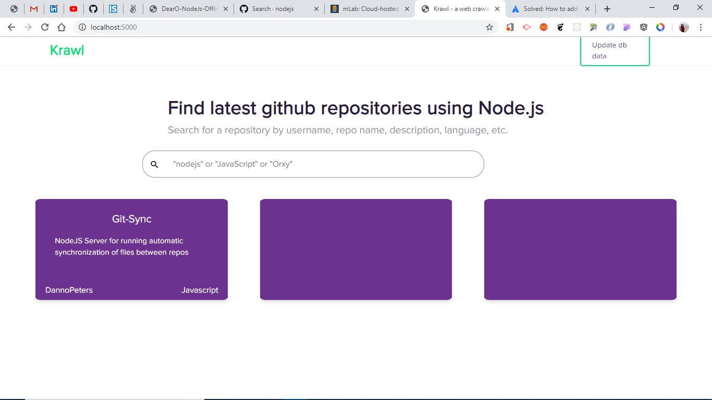
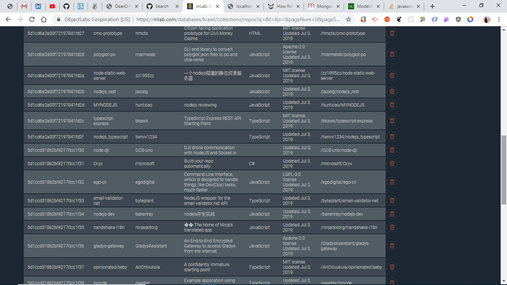

# Krawl - Find latest github repositories using Node.js

To run the application
```bash
$ git clone https://github.com/Poojavpatel/Krawl.git
$ cd Krawl
$ npm install
$ node index.js
```

This should output
```
Server started at port 5000
Connected to MongoDB
```

The application starts at port localhost:5000   
   

   
      

Clicking on "Update db data" scrapes data from url - : https://github.com/search?o=desc&q=nodejs&s=updated&type=Repositories   
and adds it to mongodb database   
   


Search by Repository title or github username or language or description